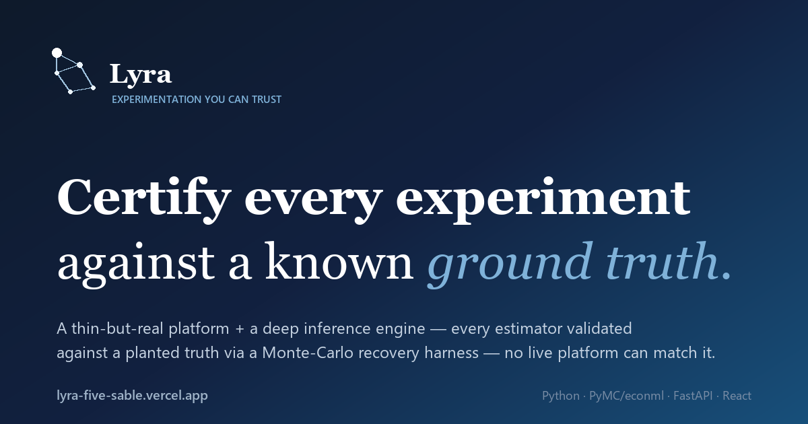

# Lyra — experimentation you can trust

**An experimentation platform where every estimator is *certified against a known ground truth*.**

[**▶ Live demo**](https://lyra-five-sable.vercel.app) &nbsp;·&nbsp; [**📖 User guide**](https://lyra-docs-chi.vercel.app) &nbsp;·&nbsp; by [Daniel Redel](https://dannyredel.github.io)



---

## The idea

Every experimentation platform faces the same epistemic wall: the treatment effect $\tau$ is **never
observed**. You see an estimate $\hat\tau$ and a confidence interval — but you can never check them against
the truth, because the counterfactual is missing by definition. So *"is this estimator correct here?"* is,
on real data, **unanswerable**.

Lyra dissolves the problem by **authoring the world**. A data-generating process plants a known effect; an
estimator sees only the observable data; and a Monte-Carlo harness checks whether the estimator **recovers
the known effect with correct interval coverage** before it is trusted:

```
coverage = P( τ ∈ CI )  ≟  1 − α        # uncheckable on real data — the gate in Lyra
```

An estimator that recovers the planted truth with nominal coverage earns a **`certified`** badge; one that
doesn't is flagged **`uncertified`**, and its bias becomes a *measured, asserted quantity* rather than a
worry. That single loop certifies every method in the platform — and turns soft methodological debates
("is the naive A/B biased here?") into hard pass/fail checks.

## What's in it

| | | |
|---|---|---|
| **Inference engine** (`lyra/`) | A 12-chapter curriculum of estimators, each built notebook-first then promoted behind an `Estimator`/`DGP` protocol and **certified by the harness**: DR/DML · CUPED & ratio-metric variance · cluster-robust SEs · interference · switchback & variance reduction · always-valid sequences · power & test-and-roll · CATE · policy/OPE · observational sensitivity · incrementality. | the crown jewel |
| **Chassis** (`chassis/`, FastAPI) | A thin-but-real platform: deterministic **assignment** · a **governed metric catalog** · the **lifecycle** state machine · a **scorecard** with the certified-vs-truth badge, an always-valid CS, SRM, and portfolio FDR · the **ship rule**. The operative create → run → decide loop. | the product |
| **Frontend** (`frontend/`, React + Vite) | Home + six industry study cases · a 4-step create wizard with a Spotify-style sample-size calculator · interactive DGP previews · a detailed-analytics scorecard (MC sampling distribution, coverage caterpillar). | the demo |
| **User guide** (`docs/`, Quarto) | The [method documentation](https://lyra-docs-chi.vercel.app) — each estimator's problem, math, and certification — rendered with LaTeX from the notebook curriculum. | the docs |

## Architecture

The four layers stay decoupled, so each can be reasoned about — and certified — on its own:

```
DGP  →  chassis (assignment · metrics · lifecycle · ship rule)  →  inference library  →  harness
 │                                                                                          │
 └────────────────  estimators GUESS · DGPs KNOW · the harness CERTIFIES  ───────────────────┘
```

Estimators **guess**; DGPs **know**. Their symmetry *is* the architecture: build the certification loop
once, and every method added later earns a "certified: yes/no" badge for free.

## The inference curriculum

Each method is built raw in a notebook, promoted to `lyra/`, and gated by a ground-truth recovery test.

| NB | Method | Module | Certified result (vs known truth) |
|---|---|---|---|
| 01 | Contracts · harness · ATE (diff/OLS/**AIPW**) | `protocols,dgp,estimators,harness` | AIPW recovers under nonlinear confounding; diff/OLS biased |
| 02 | The DGP zoo (fidelity ladder) | `dgp/` | diff-in-means recovers ATE for every outcome type |
| 03 | Metrics & variance (ratio-delta, CUPED) | `metrics` | CUPED SE strictly < naive, unbiased |
| 04 | Cluster-robust SEs (CRVE, wild bootstrap) | `se` | cluster-randomized A/A no-flag at correct size |
| 05 | Interference & designs | `dgp.InterferenceDGP` | marketplace naive *uncertified*; cluster-safe *certified* |
| 06 | Switchback & variance reduction | `dgp.SwitchbackDGP`, `estimators_vr` | Raw 0% → CUPED 45% → CUPAC 67% → DML-DR 61% |
| 07 | Sequential / always-valid + FDR | `sequential,diagnostics` | A/A confidence sequence covers 0 every day (peek-safe) |
| 08 | Power, sizing & decisions | `power,decisions` | sized design lands on nominal power; the ship rule |
| 09 | CATE (S/T/X-learner, causal forest) | `cate` | X-learner RMSE 0.21; forest honest CI covers τ(x) ~88% |
| 10 | Policy learning & OPE | `policy,ope` | DR-OPE recovers true policy value, ~2× tighter than IPS |
| 11 | Observational & sensitivity | `observational` | OVB formula recovers a hidden confounder's true bias |
| 12 | Incrementality + **real Criteo RCT** | `incrementality`, `validation` | ghost-ads CACE recovers truth; the same estimator validated on 13.9M real rows |

**65 tests pass**, including a recovery test per estimator and the asserted naive-bias / A-A-null controls.

## Tech stack

**Python** (PyMC · econml · statsmodels · linearmodels · numpy/pandas) for the engine + inference ·
**FastAPI** for the chassis · **React + Vite + Recharts** for the frontend · **Quarto** for the docs ·
**pytest** + CI for the recovery gate.

## Run it

```bash
# tests — the recovery gate
python -m pytest

# the live app (full create → run → decide loop)
uvicorn chassis.app:app --port 8000          # terminal 1 — the API
cd frontend && npm install && npm run dev     # terminal 2 — the UI (proxies /api)

# the static demo (zero-backend portfolio build)
python -m chassis.export && cd frontend && npm run build   # → frontend/dist/

# the user guide
quarto preview docs

# the notebook curriculum (jupytext-paired .py/.ipynb)
jupyter lab notebooks/
```

## Repo map

```
lyra/         the inference engine — estimators + DGPs + the harness, behind two protocols
chassis/      the FastAPI platform — assignment · metrics · lifecycle · scorecard · ship rule
frontend/     the React app (the live demo)
docs/         the Quarto user guide
notebooks/    the 12-chapter curriculum (raw → promoted to lyra/)
paper-library/ Daniel's own method notes — equation sheets (notation/) + takeaways (papers/)
labs/         applied studies — incl. a causal-measurement-for-music-marketing identification study
pm/           progress · backlog · decisions · worklog
```

## Author

**Daniel Redel** — data science, causal inference & experimentation.
[Portfolio](https://dannyredel.github.io) · [GitHub](https://github.com/dannyredel) ·
[LinkedIn](https://www.linkedin.com/in/daniel-redel-14b052b6/)
